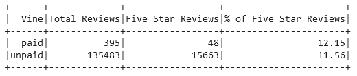

# Amazon_Vine_Analysis

## Overview

The purpopse of this analysis of Amazon reviews is determine if there is any bias concerning their Vine Program. The vine program is an invitation only program once offered you can receive products for free in an exchange for a review. 

## Results

For the video game categories we can see that there are:

- 395 Vine Reviews and 135483 non-Vine Reviews
- 48 5-star Vine reviews and 15663 5-star non-Vine
- 12.15% of Vine reviews were 5 stars and 11.56% of non-Vine reviews were 5 stars

## Summary

There is no bias, at least in the video games reviews. The difference between the percentages for 5 star reviews is negligible at less than 1%. 

For an additional analysis we may consider other categories that can provide larger sample sizes to see if there is still no bias.
